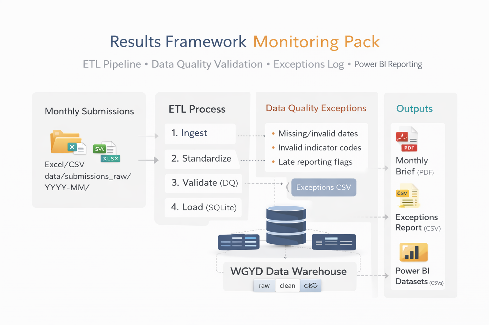

## Release Notes (v1.0.0)

### Overview
WGYD Results Framework Monitoring Pack is an automated monthly reporting workflow that turns messy, multi-team submissions (Excel today, CSV-ready) into standardized, validated reporting outputs and Power BI-ready datasets. The goal is to reduce manual monthly compilation and make data quality issues visible through structured exception logs and summaries.

### What’s included
**Automated monthly pipeline**
- **Ingest:** reads monthly submissions from `data/submissions_raw/YYYY-MM/`
- **Standardize:** cleans column names/types and aligns values to the indicator registry
- **Validate (DQ):** flags common issues (e.g., missing/invalid dates, invalid indicator codes, duplicates, missing region/team fields) and writes structured exceptions
- **Load (SQLite):** stores data in a simple warehouse-style model:
  - `raw_submissions` → `clean_submissions` → `gold_indicator_mart`
  - supporting tables: `dim_indicator_registry`, `dq_exceptions`
  - reporting views: `vw_indicator_summary_national`, `vw_indicator_trend_national`

**Outputs generated per month**
- **Exceptions report (CSV):** `data/outputs/exceptions/exceptions_YYYY-MM.csv`
- **Monthly Brief (PDF, 1 page):** `data/outputs/briefs/monthly_brief_YYYY-MM.pdf`
- **Power BI-ready exports (CSVs):** `data/outputs/powerbi/` (facts + dims + DQ rollups + late reporting flags)

### Evidence (sample outputs committed)
- Example outputs (CSV/PDF/PBIX): `reports/example_outputs/`
- Dashboard screenshots: `reports/dashboard_screenshots/`

### How to run (Windows / PowerShell)
**One-command monthly refresh**
```powershell
.\scripts\run_monthly_refresh.ps1 -Month 2025-12

